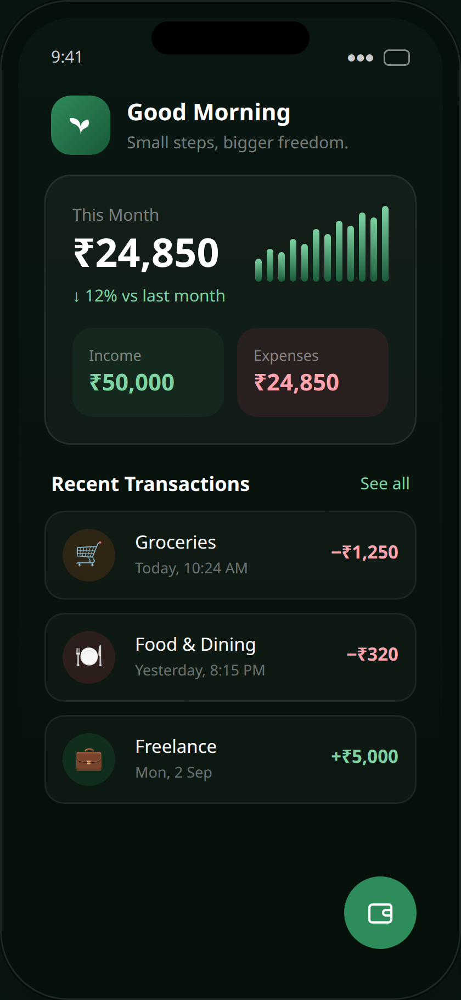
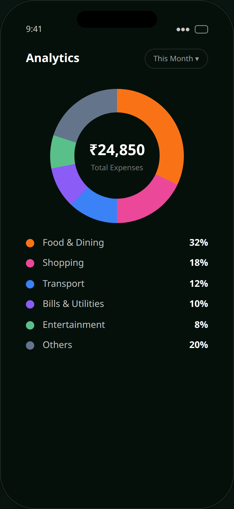
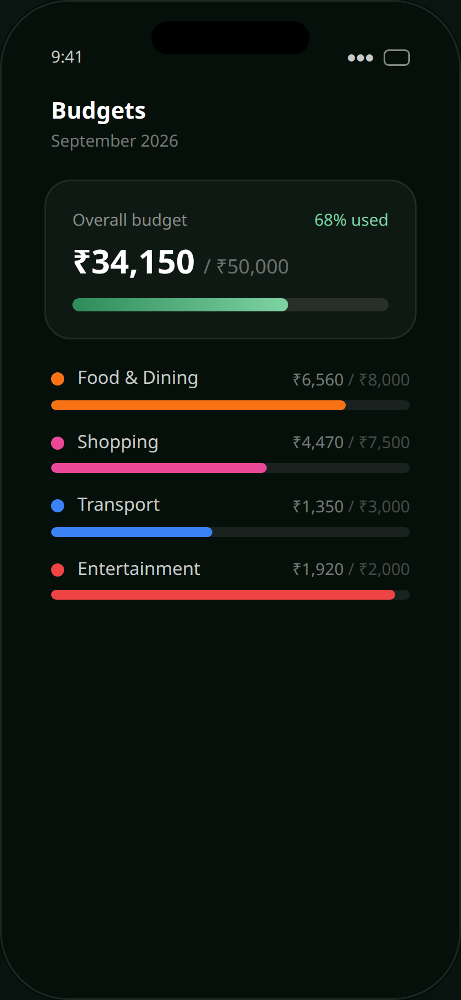

<div align="center">


<h1>Ginti&nbsp;·&nbsp;गिनती</h1>

<h3>A better way to track your money. &nbsp;<em>Free. Private. Open.</em></h3>

<p>
A <b>100% offline</b> expense tracker that lives entirely on your phone.<br/>
No accounts · no cloud · no ads · no trackers — just you and your money.
</p>

<p>


</p>

<p>


</p>

<p>
<a href="https://play.google.com/store/apps/details?id=cloud.firstanchor.ginti"></a>
&nbsp;
<a href="https://firstanchor.cloud/apk"></a>
&nbsp;
<a href="https://firstanchor.cloud"></a>
</p>

<br/>


&nbsp;&nbsp;

&nbsp;&nbsp;


</div>

---

## ✨ Everything you need. Nothing you don't.

|  |  |  |
|:--|:--|:--|
| 🔒 **Private by default** <br/> Everything stays on your phone. | ⚡ **Log in seconds** <br/> Amount, category, done. | 📊 **Clear analytics** <br/> See where it all goes. |
| 🎯 **Smart budgets** <br/> Warns before you overspend. | 🔁 **Subscriptions** <br/> Auto-logged every month. | 🔔 **Gentle reminders** <br/> A nightly recap — never spammy. |
| 💾 **Backup & export** <br/> CSV, reports, one-file restore. | 🌍 **Multi-currency** <br/> Pick your country on setup. | 🧩 **Truly yours** <br/> Customise everything. |

---

## 🔒 Your data never leaves your phone

> Most finance apps are a funnel for your data. **Ginti is the opposite** — a self-contained vault that runs entirely on-device.

- 🚫 **Zero network calls** — there's no server to talk to.
- 🙈 **No account, ever** — you're anonymous by design.
- 📵 **No analytics, no ad SDKs** — none. Really.
- 📤 **You own the export** — backups leave only when *you* tap Export.

<sub>Read the plain-English <a href="PRIVACY_POLICY.md">privacy policy</a>.</sub>

---

## 🧠 How it's built

**App** — Expo · React Native · TypeScript · expo-router · **SQLite** (on-device) · Zustand · Reanimated · gifted-charts
**Website** — Next.js · Tailwind CSS · Framer Motion · static export → Firebase Hosting

<details>
<summary><b>📂 Project structure</b></summary>

```
ginti-expense-app/
├── app-code/            # 📱 the Ginti app — Expo + React Native
│   ├── app/             #    expo-router screens (tabs, add, settings…)
│   ├── src/
│   │   ├── components/  #    UI components
│   │   ├── db/          #    SQLite schema, queries, backup/restore
│   │   ├── stores/      #    Zustand state (transactions, budgets…)
│   │   └── services/    #    reminders, subscription processor
│   └── assets/          #    brand assets (generated from assets/brand/)
├── website/             # 🌐 marketing site — Next.js → Firebase
└── assets/              # 🖼️ README media
```
</details>

---

## 🚀 Run it yourself

```bash
# 📱 The app
cd app-code
npm install
npx expo start            # scan the QR with Expo Go / a dev build

# 🌐 The website
cd website
npm install
npm run dev               # http://localhost:3000
```

<details>
<summary><b>📦 Build a release (EAS)</b></summary>

```bash
cd app-code
npm install -g eas-cli && eas login
eas build -p android --profile production      # → .aab for Google Play
eas build -p android --profile production-apk  # → sideloadable .apk
```
See <a href="app-code/PLAY_STORE.md">PLAY_STORE.md</a> for the full submission checklist.
</details>

---

## 🤝 Contributing

Ginti is a public good — contributions are genuinely welcome.

1. 🍴 Fork the repo
2. 🌿 Create a branch (`git checkout -b feature/amazing`)
3. ✅ Commit your changes
4. 🚀 Open a Pull Request

Found a bug or have an idea? [Open an issue](https://github.com/harshgupta20/ginti-expense-app/issues).

---

## 🌱 A public good by First Anchor

We believe the tools you use for something as personal as your money should be **yours** — free to use, free to inspect, free to build on. Ginti is open source because trust is easier when there's nothing to hide.

<div align="center">

**Because your money is personal.**

[Website](https://firstanchor.cloud) · [Privacy](PRIVACY_POLICY.md) · [Play Store](https://play.google.com/store/apps/details?id=cloud.firstanchor.ginti) · [Contact](mailto:hgupta427700@gmail.com)

<sub>Made with 🌿 by First Anchor · No trackers were used in the making of this app.</sub>

</div>
